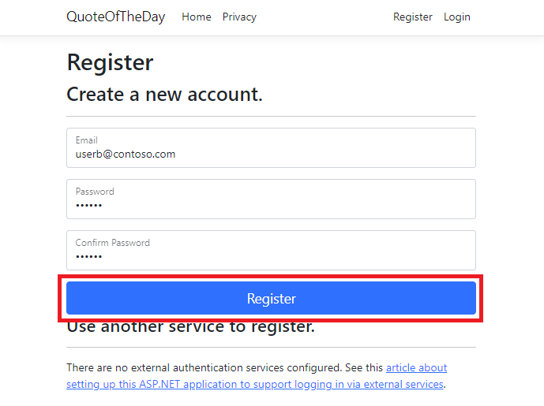
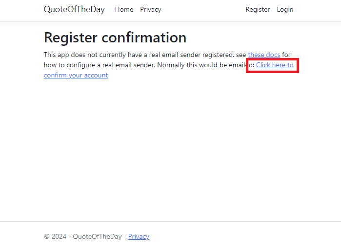
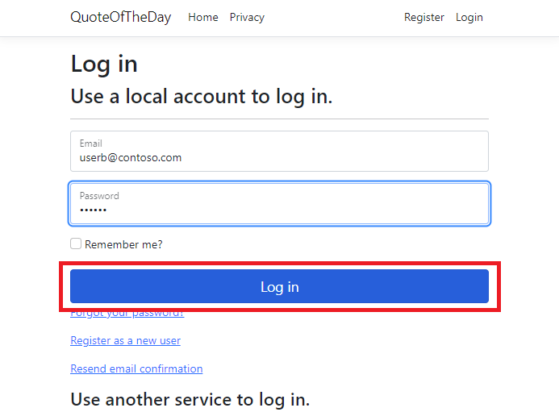

# QuoteOfTheDayQuickStart

1.

`dotnet new razor --auth Individual -o QuoteOfTheDay`


2. 

In QuoteOfTheDay.csproj add

```
<PackageReference Include="Microsoft.Azure.AppConfiguration.AspNetCore" Version="8.0.0-preview" />
<PackageReference Include="Microsoft.FeatureManagement.Telemetry.ApplicationInsights" Version="4.0.0-preview2" />
<PackageReference Include="Microsoft.FeatureManagement.Telemetry.ApplicationInsights.AspNetCore" Version="4.0.0-preview2" />
<PackageReference Include="Microsoft.FeatureManagement.AspNetCore" Version="4.0.0-preview2" />
```

3.
In cmd run 

`dotnet user-secrets set ConnectionStrings:AppConfiguration "<App Configuration Connection string>"`

4.

In cmd run

`dotnet user-secrets set ConnectionStrings:AppInsights "<App Insights Connection string>"`

5.

In `Program.cs` under the line `var builder = WebApplication.CreateBuilder(args);` add

```
builder.Configuration
    .AddAzureAppConfiguration(o =>
    {
        o.Connect(builder.Configuration.GetConnectionString("AppConfiguration"));

        o.UseFeatureFlags();
    });
```

6.

In `Program.cs` add the following using statements:

```
using Microsoft.ApplicationInsights.AspNetCore.Extensions;
using Microsoft.ApplicationInsights.Extensibility;
using Microsoft.FeatureManagement.Telemetry.ApplicationInsights.AspNetCore;
```

Under where `builder.Configuration.AddAzureAppConfiguration` is called, add:

```
        // Add Application Insights telemetry.
        builder.Services.AddApplicationInsightsTelemetry(new ApplicationInsightsServiceOptions
            {
                ConnectionString = builder.Configuration.GetConnectionString("AppInsights")
            })
            .AddSingleton<ITelemetryInitializer, TargetingTelemetryInitializer>();
```

7. In the root folder (QuoteOfTheDay) create a new file named `ExampleTargetingContextAccessor.cs`. This will create a new class named `ExampleTargetingContextAccessor`. Paste the content below into the file.

```
using Microsoft.FeatureManagement.FeatureFilters;

namespace QuoteOfTheDay
{
    public class ExampleTargetingContextAccessor : ITargetingContextAccessor
    {
        private const string TargetingContextLookup = "ExampleTargetingContextAccessor.TargetingContext";
        private readonly IHttpContextAccessor _httpContextAccessor;

        public ExampleTargetingContextAccessor(IHttpContextAccessor httpContextAccessor)
        {
            _httpContextAccessor = httpContextAccessor ?? throw new ArgumentNullException(nameof(httpContextAccessor));
        }

        public ValueTask<TargetingContext> GetContextAsync()
        {
            HttpContext httpContext = _httpContextAccessor.HttpContext;
            if (httpContext.Items.TryGetValue(TargetingContextLookup, out object value))
            {
                return new ValueTask<TargetingContext>((TargetingContext)value);
            }
            List<string> groups = new List<string>();
            if (httpContext.User.Identity.Name != null)
            {
                groups.Add(httpContext.User.Identity.Name.Split("@", StringSplitOptions.None)[1]);
            }
            TargetingContext targetingContext = new TargetingContext
            {
                UserId = httpContext.User.Identity.Name,
                Groups = groups
            };
            httpContext.Items[TargetingContextLookup] = targetingContext;
            return new ValueTask<TargetingContext>(targetingContext);
        }
    }
}
```

8. Naviagte back to Program.cs and add the following using statements.

```
using Microsoft.FeatureManagement.Telemetry.ApplicationInsights;
using Microsoft.FeatureManagement;
using QuoteOfTheDay;
```

Then under where `AddApplicationInsightsTelemetry` was called, add

```
builder.Services.AddHttpContextAccessor();

// Add Azure App Configuration and feature management services to the container.
builder.Services.AddAzureAppConfiguration()
    .AddFeatureManagement()
    .WithTargeting<ExampleTargetingContextAccessor>()
    .AddTelemetryPublisher<ApplicationInsightsTelemetryPublisher>();
```

9. Under the line `var app = builder.Build();` add

```
// Use Azure App Configuration middleware for dynamic configuration refresh.
app.UseAzureAppConfiguration();
```

10. Under that add

```
// Add TargetingId to HttpContext for telemetry
app.UseMiddleware<TargetingHttpContextMiddleware>();
```

11. In QuoteOfTheDay > Pages > Shared > _Layout.cshtml under where 'QuoteOfTheDay.styles.css' is added, add the following line

```
<link rel="stylesheet" href="https://cdnjs.cloudflare.com/ajax/libs/font-awesome/5.15.3/css/all.min.css">
```

12. Open QuoteOfTheDay > Pages > Index.cshtml.cs and overwrite the content to the quote app

```
using Microsoft.ApplicationInsights;
using Microsoft.AspNetCore.Mvc;
using Microsoft.AspNetCore.Mvc.RazorPages;
using Microsoft.FeatureManagement;

namespace QuoteOfTheDay.Pages;

public class Quote
{
    public string Message { get; set; }

    public string Author { get; set; }
}

public class IndexModel(IVariantFeatureManagerSnapshot featureManager, TelemetryClient telemetryClient) : PageModel
{
    private readonly IVariantFeatureManagerSnapshot _featureManager = featureManager;
    private readonly TelemetryClient _telemetryClient = telemetryClient;

    private Quote[] _quotes = [
        new Quote()
        {
            Message = "You cannot change what you are, only what you do.",
            Author = "Philip Pullman"
        }];

    public Quote? Quote { get; set; }

    public bool ShowGreeting { get; set; }

    public async void OnGet()
    {
        Quote = _quotes[new Random().Next(_quotes.Length)];

        Variant variant = await _featureManager.GetVariantAsync("Greeting", HttpContext.RequestAborted);

        ShowGreeting = variant.Configuration.Get<bool>();
    }

    public IActionResult OnPostHeartQuoteAsync()
    {
        string? userId = User.Identity?.Name;

        if (!string.IsNullOrEmpty(userId))
        {
            // Send telemetry to Application Insights
            _telemetryClient.TrackEvent("Like");

            return new JsonResult(new { success = true });
        }
        else
        {
            return new JsonResult(new { success = false, error = "User not authenticated" });
        }
    }
}
```

13. Open index.cshtml and overwrite the content for the quote app

```
@page
@model IndexModel
@{
    ViewData["Title"] = "Home page";
    ViewData["Username"] = User.Identity.Name;
}

<style>
    body {
        font-family: Arial, sans-serif;
        background-color: #f4f4f4;
        color: #333;
    }

    .quote-container {
        background-color: #fff;
        margin: 2em auto;
        padding: 2em;
        border-radius: 8px;
        max-width: 750px;
        box-shadow: 0px 4px 8px rgba(0, 0, 0, 0.2);
        display: flex;
        justify-content: space-between;
        align-items: start;
        position: relative;
    }

    .vote-container {
        position: absolute;
        top: 10px;
        right: 10px;
        display: flex;
        gap: 0em;
    }

    .vote-container .btn {
        background-color: #ffffff; /* White background */
        border-color: #ffffff; /* Light blue border */
        color: #333
    }

    .vote-container .btn:focus {
        outline: none;
        box-shadow: none;
    }

    .vote-container .btn:hover {
        background-color: #F0F0F0; /* Light gray background */
    }

    .greeting-content {
        font-family: 'Georgia', serif; /* More artistic font */
    }

    .quote-content {
        flex-grow: 1;
    }

    .quote-content p.quote {
        font-size: 2em; /* Bigger font size */
        font-family: 'Georgia', serif; /* More artistic font */
        font-style: italic; /* Italic font */
            color: #4EC2F7; /* Medium-light blue color */
        quotes: "\201C""\201D""\2018""\2019"; /* CSS for adding quotation marks */
    }

    .quote-content p.quote:before {
        content: open-quote; /* Add opening quote */
    }

    .quote-content p.quote:after {
        content: close-quote; /* Add closing quote */
    }
</style>

<div class="quote-container">
    <div class="quote-content">
        @if (Model.ShowGreeting)
        {
            <h3 class="greeting-content">Hi <b>@User.Identity.Name</b>, hope this makes your day!</h3>
        }
        else
        {
            <h3 class="greeting-content">Quote of the day</h3>
        }
        <br />
        <p class="quote">@Model.Quote.Message</p>
        <p>- <b>@Model.Quote.Author</b></p>
    </div>

    <div class="vote-container">
        <button class="btn btn-primary" onclick="heartClicked(this)">
            <i class="far fa-heart"></i> <!-- Heart icon -->
        </button>
    </div>

    <form action="/" method="post">
        @Html.AntiForgeryToken()
    </form>
</div>

<script>
    function heartClicked(button) {
        var icon = button.querySelector('i');
        icon.classList.toggle('far');
        icon.classList.toggle('fas');

        // If the quote is hearted
        if (icon.classList.contains('fas')) {
            // Send a request to the server to save the vote
            fetch('/Index?handler=HeartQuote&username=@User.Identity.Name', {
                method: 'POST',
                headers: {
                    'Content-Type': 'application/json',
                    'RequestVerificationToken': document.querySelector('input[name="__RequestVerificationToken"]').value
                },
                body: JSON.stringify({
                    userId: '@User.Identity.Name'
                })
            });
        }
    }
</script>
```

14. In cmd, in the QuoteOfTheDay folder, run: `dotnet build`
15. Run: `dotnet run --launch-profile https`
16. In your web browser, navigate to: https://localhost:7206
17. Once viewing the running aplication, click register at the top right to register a new user, make sure to click the "click here to validate email" link after inputting user information and clicking register.


18. Register a new user named "userb@contoso.com". The password must be at least 6 characters, contain a number, and contain a special character.



Make two users: "user@contoso.com" (off) & "userb@contoso.com" (on)

19. Make sure to click the activate account link  to complete registration.



20. Click the login button at the top right to log in as user b (userb@contoso.com).




21. Once logged in, you should see that userb@contoso.com sees a special message when viewing the app.


If you create a new user named user@contoso.com, the user will not see the special message.
